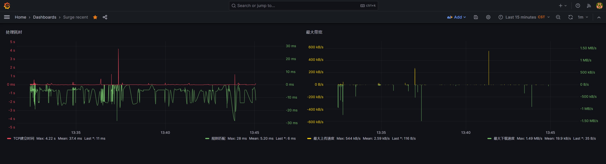
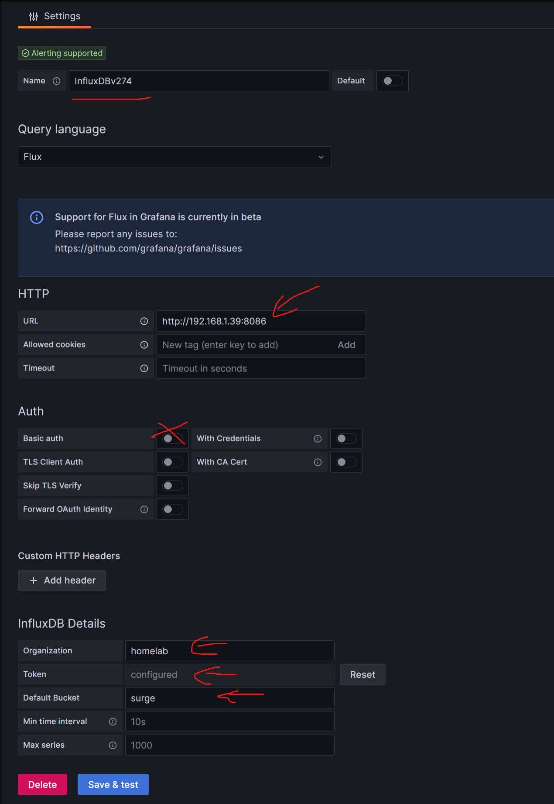

# Surge Recent data Dashboard

Get recent data by Surge HTTP-API and set up the Grafana dashboard. 

### Screenshot

### How to use

1. modify `docker-compose.yaml` 
2. start `docker-compose run influxdb`
3. Open the browser to http://influxdb-ip-address:8086 to set up TOKEN.
4. revise `.env`, and change settings accordingly, especially the `**MUST**` value. 
4. start `docker-compose up -d`
5. setup Grafana (add datasource)
6. import `panels/dashboard.json` and `panels/logs.json` to Grafana

#### data source setting example

